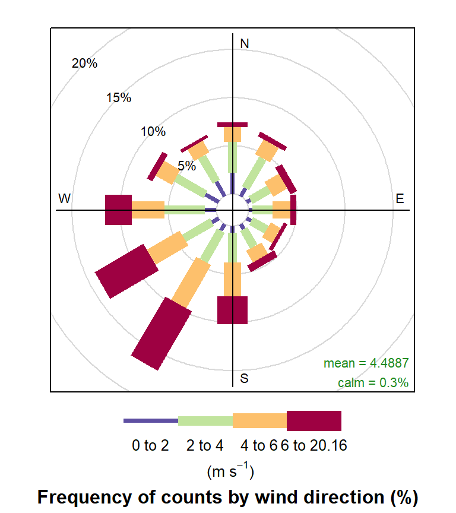
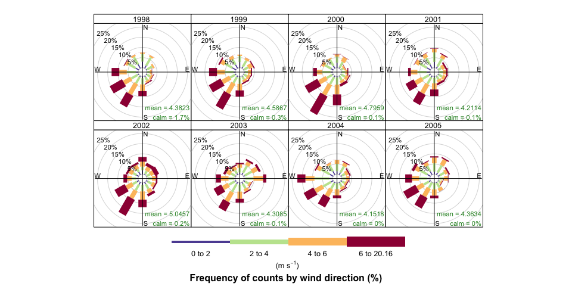
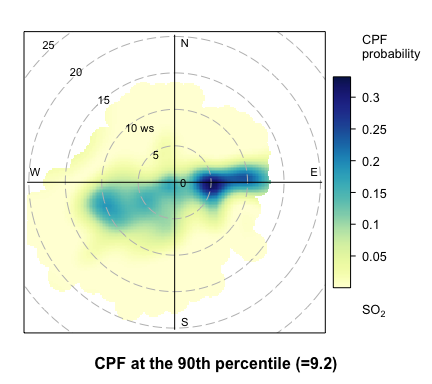

<!-- README.md is generated from README.Rmd. Please edit that file -->

# openair: open source tools for air quality data analysis 

<!-- badges: start -->

[](https://github.com/davidcarslaw/openair/actions)
[](https://CRAN.R-project.org/package=openair)

<!-- badges: end -->

**openair** is an R package developed for the purpose of analysing air
quality data — or more generally atmospheric composition data. The
package is extensively used in academia, the public and private sectors.
The project was initially funded by the UK Natural Environment Research
Council ([NERC](https://www.ukri.org/councils/nerc/)), with additional
funds from Defra.

The most up to date information on `openair` can be found in the package
itself and at the book website
(<https://bookdown.org/david_carslaw/openair/>).

## Installation

Installation can be done in the normal way:

``` r
install.packages("openair")
```

The development version can be installed from GitHub. Installation of
`openair` from GitHub is easy using the `pak` package. Note, because
`openair` contains C++ code a compiler is also needed. For Windows - for
example, [Rtools](https://cran.r-project.org/bin/windows/Rtools/) is
needed.

``` r
# install.packages("pak")
pak::pak("davidcarslaw/openair")
```

## Description

`openair` has developed over several years to help analyse air quality
data.

This package continues to develop and input from other developers would
be welcome. A summary of some of the features are:

- **Access to data** from several hundred UK air pollution monitoring
  sites through the `importAURN` and family functions.
- **Utility functions** such as `timeAverage` and `selectByDate` to make
  it easier to manipulate atmospheric composition data.
- Flexible **wind and pollution roses** through `windRose` and
  `pollutionRose`.
- Flexible plot conditioning to easily plot data by hour or the day, day
  of the week, season etc. through the `openair` `type` option available
  in most functions.
- More sophisticated **bivariate polar plots** and conditional
  probability functions to help characterise different sources of
  pollution. A paper on the latter is available
  [here](https://www.sciencedirect.com/science/article/pii/S1364815214001339).
- Access to NOAA Hysplit pre-calculated annual 96-hour back
  **trajectories** and many plotting and analysis functions e.g.
  trajectory frequencies, Potential Source Contribution Function and
  trajectory clustering.
- Many functions for air quality **model evaluation** using the flexible
  methods described above e.g. the `type` option to easily evaluate
  models by season, hour of the day etc. These include key model
  statistics, Taylor Diagram, Conditional Quantile plots.

## Brief examples

### Import data from the UK Automatic Urban and Rural Network

It is easy to import hourly data from 100s of sites and to import
several sites at one time and several years of data.

``` r
library(openair)
kc1 <- importAURN(site = "kc1", year = 2020)
kc1
#> # A tibble: 8,784 × 15
#>    source site     code  date                   co   nox   no2    no    o3   so2
#>    <chr>  <chr>    <chr> <dttm>              <dbl> <dbl> <dbl> <dbl> <dbl> <dbl>
#>  1 aurn   London … KC1   2020-01-01 00:00:00 0.214  64.8  46.2 12.1   1.13    NA
#>  2 aurn   London … KC1   2020-01-01 01:00:00 0.237  74.1  45.0 19.0   1.20    NA
#>  3 aurn   London … KC1   2020-01-01 02:00:00 0.204  60.5  41.4 12.4   1.50    NA
#>  4 aurn   London … KC1   2020-01-01 03:00:00 0.204  53.5  39.8  8.93  1.60    NA
#>  5 aurn   London … KC1   2020-01-01 04:00:00 0.169  37.7  33.6  2.63  5.79    NA
#>  6 aurn   London … KC1   2020-01-01 05:00:00 0.160  43.3  36.8  4.25  6.09    NA
#>  7 aurn   London … KC1   2020-01-01 06:00:00 0.157  48.2  39.4  5.76  2.74    NA
#>  8 aurn   London … KC1   2020-01-01 07:00:00 0.178  60.5  44.7 10.3   1.20    NA
#>  9 aurn   London … KC1   2020-01-01 08:00:00 0.233  71.8  47.9 15.6   2.25    NA
#> 10 aurn   London … KC1   2020-01-01 09:00:00 0.329 128.   46.9 53.2   2.25    NA
#> # ℹ 8,774 more rows
#> # ℹ 5 more variables: pm10 <dbl>, pm2.5 <dbl>, ws <dbl>, wd <dbl>,
#> #   air_temp <dbl>
```

### Utility functions

Using the `selectByDate` function it is easy to select quite complex
time-based periods. For example, to select weekday (Monday to Friday)
data from June to September for 2012 *and* for the hours 7am to 7pm
inclusive:

``` r
sub <- selectByDate(kc1,
  day = "weekday",
  year = 2020,
  month = 6:9,
  hour = 7:19
)
sub
#> # A tibble: 1,144 × 15
#>    date                source site    code      co   nox   no2    no    o3   so2
#>    <dttm>              <chr>  <chr>   <chr>  <dbl> <dbl> <dbl> <dbl> <dbl> <dbl>
#>  1 2020-06-01 07:00:00 aurn   London… KC1   0.125   23.1 16.8  4.14   56.5  2.29
#>  2 2020-06-01 08:00:00 aurn   London… KC1   0.133   25.2 17.8  4.79   61.7  2.68
#>  3 2020-06-01 09:00:00 aurn   London… KC1   0.119   15.6 12.2  2.22   75.8  2.35
#>  4 2020-06-01 10:00:00 aurn   London… KC1   0.104   13.8 11.1  1.79   87.1  1.57
#>  5 2020-06-01 11:00:00 aurn   London… KC1   0.0956  14.0 11.8  1.46   96.7  1.44
#>  6 2020-06-01 12:00:00 aurn   London… KC1   0.0985  11.3  9.97 0.893 106.   1.44
#>  7 2020-06-01 13:00:00 aurn   London… KC1   0.0927  11.0  9.64 0.893 112.   2.03
#>  8 2020-06-01 14:00:00 aurn   London… KC1   0.0927  12.5 10.8  1.14  114.   2.81
#>  9 2020-06-01 15:00:00 aurn   London… KC1   0.0811  10.7  9.48 0.822 115.   2.88
#> 10 2020-06-01 16:00:00 aurn   London… KC1   0.0898  13.9 11.9  1.29  104.   2.22
#> # ℹ 1,134 more rows
#> # ℹ 5 more variables: pm10 <dbl>, pm2.5 <dbl>, ws <dbl>, wd <dbl>,
#> #   air_temp <dbl>
```

Similarly it is easy to time-average data in many flexible ways. For
example, 2-week means can be calculated as

``` r
sub2 <- timeAverage(kc1, avg.time = "2 week")
```

### The `type` option

One of the key aspects of `openair` is the use of the `type` option,
which is available for almost all `openair` functions. The `type` option
partitions data by different categories of variable. There are many
built-in options that `type` can take based on splitting your data by
different date values. A summary of in-built values of type are:

- “year” splits data by year
- “month” splits variables by month of the year
- “monthyear” splits data by year *and* month
- “season” splits variables by season. Note in this case the user can
  also supply a `hemisphere` option that can be either “northern”
  (default) or “southern”
- “weekday” splits variables by day of the week
- “weekend” splits variables by Saturday, Sunday, weekday
- “daylight” splits variables by nighttime/daytime. Note the user must
  supply a `longitude` and `latitude`
- “dst” splits variables by daylight saving time and non-daylight saving
  time (see manual for more details)
- “wd” if wind direction (`wd`) is available `type = "wd"` will split
  the data up into 8 sectors: N, NE, E, SE, S, SW, W, NW.
- “seasonyear (or”yearseason”) will split the data into year-season
  intervals, keeping the months of a season together. For example,
  December 2010 is considered as part of winter 2011 (with January and
  February 2011). This makes it easier to consider contiguous seasons.
  In contrast, `type = "season"` will just split the data into four
  seasons regardless of the year.

If a categorical variable is present in a data frame e.g. `site` then
that variables can be used directly e.g. `type = "site"`.

`type` can also be a numeric variable. In this case the numeric variable
is split up into 4 *quantiles* i.e. four partitions containing equal
numbers of points. Note the user can supply the option `n.levels` to
indicate how many quantiles to use.

### Example directional analysis

`openair` can plot basic wind roses very easily provided the variables
`ws` (wind speed) and `wd` (wind direction) are available.

``` r
windRose(mydata)
```

<div class="figure">


<p class="caption">
A wind rose summarising the wind conditions at a monitoring station.
</p>

</div>

However, the real flexibility comes from being able to use the `type`
option.

``` r
windRose(mydata,
  type = "year",
  layout = c(4, 2)
)
```

<div class="figure">


<p class="caption">
Wind roses summarising the wind conditions at a monitoring station per
year, demonstrating the `{openair}` type option.
</p>

</div>

There are many flavours of bivariate polar plots, as described
[here](https://bookdown.org/david_carslaw/openair/sections/directional-analysis/polar-plots.html)
that are useful for understanding air pollution sources.

``` r
polarPlot(mydata,
  pollutant = "so2",
  statistic = "cpf",
  percentile = 90,
  cols = "YlGnBu"
)
```

<div class="figure">


<p class="caption">
A bivariate polar plot showing the wind conditions which give rise to
elevated pollutant concentrations.
</p>

</div>
