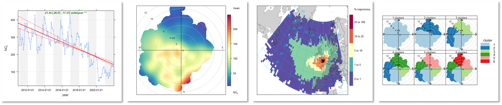

<div align="center">


## **openair**
### open source tools for air quality data analysis

<!-- badges: start -->
[](https://github.com/davidcarslaw/openair/actions)
[](https://CRAN.R-project.org/package=openair)
[](https://cran.r-project.org/package=openair)
<br>
[](https://github.com/davidcarslaw/openair)
[](https://davidcarslaw.github.io/openair)
[](https://bookdown.org/david_carslaw/openair/)
<!-- badges: end -->

</div>

**openair** is an R package developed for the purpose of analysing air quality data — or more generally atmospheric composition data. The package is extensively used in academia, the public and private sectors. The project was initially funded by the UK Natural Environment Research Council ([NERC](https://www.ukri.org/councils/nerc/)), with additional funds from the UK Department for Environment Food & Rural Affairs ([Defra](https://www.gov.uk/government/organisations/department-for-environment-food-rural-affairs)).

<div align="center">

*Part of the openair toolkit*

[](https://davidcarslaw.github.io/openair) | 
[](https://davidcarslaw.github.io/worldmet) | 
[](https://davidcarslaw.github.io/openairmaps) | 
[](https://davidcarslaw.github.io/deweather)

</div>

<hr>

## 💡 Core Features

**openair** has developed over many years to form an extensive toolkit of functions for analysing air quality and atmospheric composition data.

- **Access to data** from several hundred UK air pollution monitoring sites through the `importUKAQ()` family of functions.

- **Time Series & Trend analysis** to explore how air quality concentrations vary over time (e.g., through `timePlot()`, `timeVariation()`, and `calendarPlot()`).

- **Directional analysis** to help characterise different sources of pollution, including the creation of **bivariate polar plots** using `polarPlot()`.

- **Trajectory analysis** to examine NOAA Hysplit trajectories, with plotting (`trajPlot()`), heatmap (`trajLevel()`) and clustering (`trajCluster()`) functionality.

- **Utility functions**, such as `timeAverage()` and `selectByDate()` to make it easier to manipulate atmospheric composition data.

- **Flexible plot conditioning** to easily plot data by hour or the day, day of the week, season of the year, etc., through the `type` option available in most functions.

<div align="center">

</div>

<hr>

## 📖 Documentation

All **openair** functions are fully documented; access documentation using R in your IDE of choice.

```r
?openair::polarPlot
```

Documentation is also hosted online on the **package website**.

[](https://davidcarslaw.github.io/openair)

A guide to the openair toolkit can be found in the **online book**, which contains lots of code snippets, demonstrations of functionality, and ideas for the application of **openair**'s various functions.

[](https://bookdown.org/david_carslaw/openair/)

<hr>

## 🗃️ Installation

**openair** can be installed from **CRAN** with:

``` r
install.packages("openair")
```

You can also install the development version of **openair** from GitHub using `{pak}`:

``` r
# install.packages("pak")
pak::pak("davidcarslaw/openair")
```

<hr>

🏛️ **openair** is primarily maintained by [David Carslaw](https://github.com/davidcarslaw).

📃 **openair** is licensed under the [GNU General Public License](https://davidcarslaw.github.io/openair/LICENSE.html).

🧑‍💻 Contributions are welcome from the wider community. See the [contributing guide](https://davidcarslaw.github.io/openair/CONTRIBUTING.html) and [code of conduct](https://davidcarslaw.github.io/openair/CODE_OF_CONDUCT.html) for more information.
