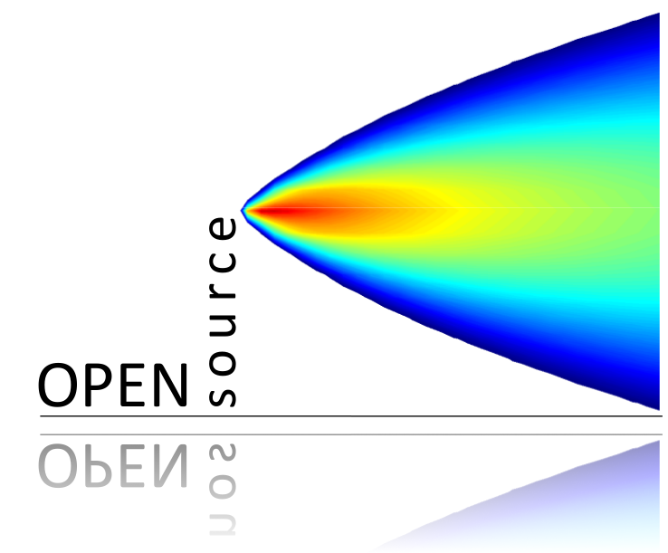
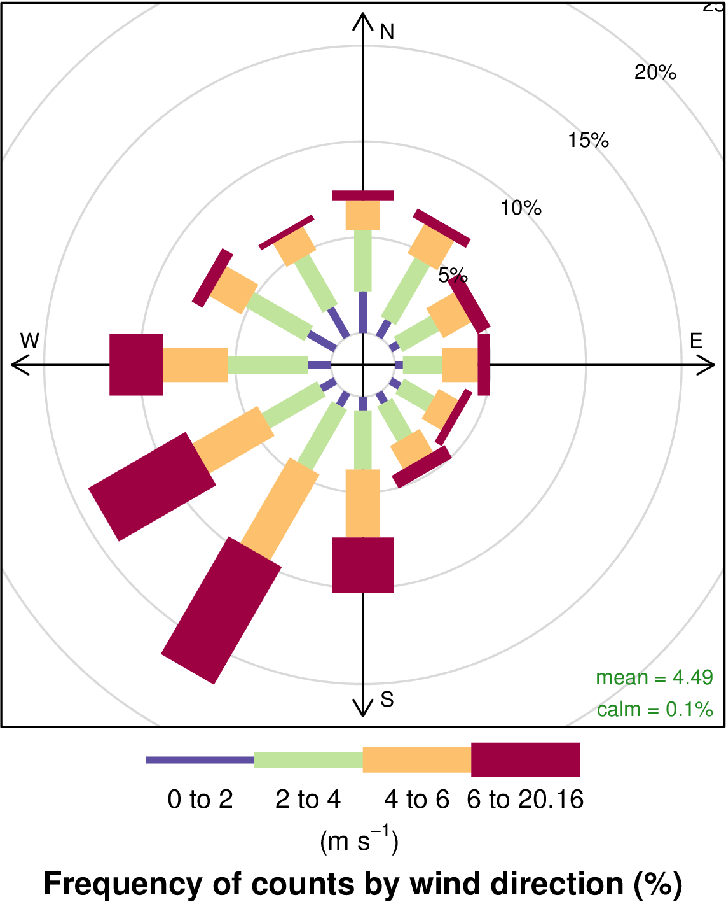
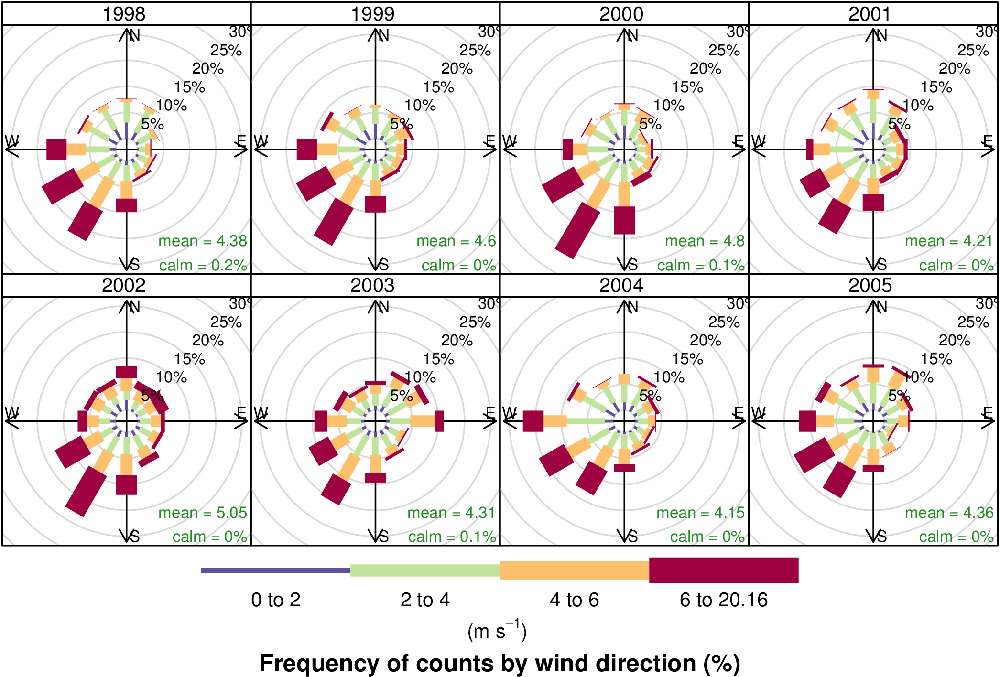

# openair

[](https://travis-ci.org/davidcarslaw/openair)
[](http://cran.r-project.org/web/packages/openair)
[](http://cran.rstudio.com/package=openair)

# openair - R package for air quality data analysis



openair is an R package developed for the purpose of analysing air
quality data - or more generally atmospheric composition data. The
package is extensively used in academia, the public and private
sectors. The project was initially funded by the UK Natural
Environment Research Council ([NERC](http://www.nerc.ac.uk/)), with
additional funds from Defra. The most up to date information on
openair can be found in the package itself and the
[manual](https://www.dropbox.com/s/2n7wdyursdul8dk/openairManual.pdf?dl=0)
which provides an introduction to R with a focus on air quality data
as well as extensive reproducible examples.

## Installation

Installation of openair from GitHub is easy using the devtools
package. Note, because openair contains C++ code a compiler is also
needed. For Windows - for example,
[Rtools](http://cran.r-project.org/bin/windows/Rtools/) is needed.

```R
require(devtools)
install_github('davidcarslaw/openair')
```

I also try to keep up to date versions of the package
[here](https://www.dropbox.com/sh/x8mmf5d54wfo5vq/AACpKqsrPkTC0guiu5ftiKNna?dl=0)
if you can't build the package yourself.

## Description

openair has developed over several years to help analyse atmospheric composition data; initially focused on air quality data. 

This package icontinues to develop and input from other developers would be welcome. A summary of some of the features are:

- **Access to data** from several hundred UK air pollution monitoring
  sites through the `importAURN` and `importKCL` functions as well as
  archive data from the EEA (European Environment Agency)
  [Airbase](http://www.eea.europa.eu/themes/air/air-quality/map/airbase)
  database.
- **Utility functions** such as `timeAverage` and `selectByDate` to
  make it easier to manipulate atmospheric composition data.
- Flexible **wind and pollution roses** through `windRose` and `pollutionRose`.
- Flexible plot conditioning to easily plot data by hour or the day,
  day of the week, season etc. through the openair `type` option
  available in most functions.
- More sophisticated **bivariate polar plots** and conditional
  probability functions to help characterise different sources of
  pollution. A paper on the latter is available
  [here](http://www.sciencedirect.com/science/article/pii/S1364815214001339).
- Access to NOAA [Hysplit](http://ready.arl.noaa.gov/HYSPLIT.php)
  pre-calculated annual 96-hour back **trajectories** and many
  plotting and analysis functions e.g. trajectory frequencies,
  Potential Source Contribution Function and trajectory clustering.
- Many functions for air quality **model evaluation** using the
  flexible methods described above e.g. the `type` option to easily
  evaluate models by season, hour of the day etc. These include key
  model statistics, Taylor Diagram, Conditional Quantile plots.

## Brief examples

### Import data from the UK Automatic Urban and Rural Network

It is easy to import hourly data from 100s of sites and to import
several sites at one time and several years of data.

```R
kc1 <- importAURN(site = "kc1", year = 2011:2012)
> head(kc1)
                 date o3 no2  co so2 pm10 nox no pm2.5 nv2.5 v2.5 nv10 v10  ws    wd                 site
1 2011-01-01 00:00:00 14  38 0.2   5   40  44  4    39    32    7   32   8 1.1 266.7 London N. Kensington
2 2011-01-01 01:00:00 28  29 0.2   3   36  38  6    30    24    6   29   7 1.2 271.9 London N. Kensington
3 2011-01-01 02:00:00 18  31 0.2   3   31  32  1    31    23    8   24   7 1.5 276.3 London N. Kensington
4 2011-01-01 03:00:00 14  29 0.2   3   31  31  1    29    21    8   23   8 2.1 278.7 London N. Kensington
5 2011-01-01 04:00:00 16  29 0.2   3   29  31  1    25    19    6   21   8 2.7 289.6 London N. Kensington
6 2011-01-01 05:00:00 24  27 0.1   3   25  29  1    23    16    7   18   7 2.8 303.6 London N. Kensington
  code
1  KC1
2  KC1
3  KC1
4  KC1
5  KC1
6  KC1
```

### Utility functions

Using the `selectByDate` function it is easy to select quite complex
time-based periods. For example, to select weekday (Monday to Friday)
data from June to September for 2012 *and* for the hours 7am to 7pm
inclusive:

```R
sub <- selectByDate(kc1, day = "weekday", year = 2012, month = 6:9, hour = 7:19)
> head(sub)
                     date o3 no2   co so2 pm10 nox no pm2.5 nv2.5 v2.5 nv10 v10  ws    wd
12416 2012-06-01 07:00:00 24  23 0.23   3    6  36  9    21    14    7    5   1 1.4 307.4
12417 2012-06-01 08:00:00 34  21 0.23   3    9  33  7    NA    NA   NA    8   1 1.6 313.6
12418 2012-06-01 09:00:00 52  19 0.23   3    6  23  2    NA    NA   NA    3   3 1.6 330.0
12419 2012-06-01 10:00:00 62  13 0.23   3    7  17  2    NA    NA   NA    4   3 1.5 348.9
12420 2012-06-01 11:00:00 70  13 0.23   3    9  17  2    14     7    7    6   3 1.4 181.1
12421 2012-06-01 12:00:00 78  19 0.23   3    8  21  1    13     7    6    4   4 1.6   2.9
                      site code
12416 London N. Kensington  KC1
12417 London N. Kensington  KC1
12418 London N. Kensington  KC1
12419 London N. Kensington  KC1
12420 London N. Kensington  KC1
12421 London N. Kensington  KC1
```

Similalry it is easy to time-average data in many flexible ways. For
example, 2-week means can be calculated as

```R
sub2 <- timeAverage(kc1, avg.time = "2 week")
```

### The `type` option

One of the key aspects of openair is the use of the `type` option,
which is available for almost all openair functions. The `type` option
partitions data by different categories of variable. There are many
built-in options that `type` can take based on splitting your data by
different date values. A summary of in-built values of type are:

* "year" splits data by year
* "month" splits variables by month of the year
* "monthyear" splits data by year *and* month
* "season" splits variables by season. Note in this case the user can
  also supply a `hemisphere` option that can be either "northern"
  (default) or "southern"
* "weekday" splits variables by day of the week
* "weekend" splits variables by Saturday, Sunday, weekday
* "daylight" splits variables by nighttime/daytime. Note the user must
  supply a `longitude` and `latitude`
* "dst" splits variables by daylight saving time and non-daylight
  saving time (see manual for more details)
* "wd" if wind direction (`wd`) is available `type = "wd"` will split
  the data up into 8 sectors: N, NE, E, SE, S, SW, W, NW.

If a categorical variable is present in a data frame e.g. `site` then
that variables can be used directly e.g. `type = "site"`.

`type` can also be a numeric variable. In this case the numeric
variable is split up into 4 *quantiles* i.e. four partitions
containing equal numbers of points. Note the user can supply the
option `n.levels` to indicate how many quantiles to use.

### Wind roses and pollution roses

openair can plot basic wind roses very easily provided the variables
`ws` (wind speed) and `wd` (wind direction) are available.

```R
windRose(mydata)
```


However, the real flexibility comes from being able to use the `type` option.

```R
windRose(mydata, type = "year", layout = c(4, 2))
```

